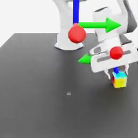

# Isaac Labを用いたVLA開発：Franka Cube Lift



*学習済みRobomimic BC-RNNによるキューブ把持成功例*

## プロジェクト概要

本プロジェクトは、NVIDIA Isaac Lab上でVision-Language-Action（VLA）ロボットを構築することを目的とした実験です。

現在はVLAへ発展させるための画像ベース行動学習ベースラインとして、Franka Pandaが卓上カメラ、手首カメラ、ロボット状態を観測し、キューブへの接近・把持・持ち上げを行います。

> **現在の到達点:** VisionとActionは実装済みです。Languageはまだモデル入力に含まれていないため、現段階は完全なVLAではありません。

## プロジェクト構成

フォルダ番号は、環境確認から評価・再現までの実施順を表します。

```text
isaac-lab-vla-cube-lift_1/
├── README_JPN.md
├── README_ENG.md
├── 01_environment/
│   ├── 01_validate_environment.py
│   ├── ik_rel_visuomotor_env_cfg.py
│   └── requirements/
├── 02_data_collection/
│   ├── 02_collect_demonstrations.py
│   └── data/
├── 03_training/
│   ├── bc_rnn_image_lift.json
│   └── models/
├── 04_evaluation/
│   ├── 04_evaluate_policy.py
│   ├── 05_offline_diagnostic.py
│   └── evaluation_summary.csv
├── 05_reproduction/
│   ├── 06_replay_success_trace.py
│   ├── success_action_trace.npz
│   └── experiment_summary_JPN.md
├── 06_videos/
│   ├── franka_cube_lift_success.png
│   ├── policy_success.mp4
│   ├── policy_failure.mp4
│   └── exact_replay_success.mp4
├── 07_documents/
└── 99_archive/
```

## 実行フロー

1. `01_environment`：Isaac Lab環境とObservationを検証
2. `02_data_collection`：State Machineから成功デモを収集
3. `03_training`：Robomimic BC-RNN-GMMを学習
4. `04_evaluation`：学習済み方策を閉ループ評価
5. `05_reproduction`：成功行動列を完全リプレイ
6. `06_videos`：成功・失敗・再現動画を確認

## 01. 環境

- GPU: NVIDIA GeForce RTX 4090
- Isaac Sim: 6.0.1 RC
- Isaac Lab: develop branch
- Robot: Franka Panda
- Task: `IsaacContrib-Lift-Cube-Franka-IK-Rel-Visuomotor`
- Control: Differential IK, relative pose
- Control frequency: 50 Hz
- Imitation-learning framework: Robomimic 0.4.0

### Observation

| Key | 内容 |
|---|---|
| `table_cam` | 卓上RGBカメラ、200 × 200 × 3 |
| `wrist_cam` | 手首RGBカメラ、200 × 200 × 3 |
| `eef_pos` | エンドエフェクタ位置 |
| `eef_quat` | エンドエフェクタ姿勢 |
| `gripper_pos` | グリッパー関節状態 |

### Action

```text
[x, y, z, rx, ry, rz, gripper]
```

先頭6次元はIK-Rel指令、最後の1次元はグリッパー指令です。

## 02. データ収集

Isaac LabのState Machineを教師として、ランダム化されたキューブ初期位置から50件の成功デモを収集しました。データはRobomimic形式のHDF5で、時系列のカメラ画像、ロボット状態、教師Actionを含みます。

言語指示は現在の学習データおよびモデル入力には含まれていません。完全版HDF5は、容量を確認したうえでGitHub Releasesまたは外部ストレージへ配置します。

## 03. 学習

- Algorithm: Behavior Cloning
- Policy: BC-RNN-GMM
- Demonstrations: 50 successful episodes
- Epochs: 200
- Checkpoint: `model_epoch_200.pth`
- Configuration: `03_training/bc_rnn_image_lift.json`

学習にはIsaac Lab公式スクリプトを使用しました。

```text
/workspace/IsaacLab-develop/scripts/imitation_learning/robomimic/train.py
```

## 04. 評価

| 評価項目 | 結果 |
|---|---:|
| 初期10 rollout | 1/10 |
| seed探索 | 1/48 |
| 成功seed | 2058 |
| 成功時初期位置 | (0.426184, 0.179950, 0.055000) |
| Offline overall MAE | 0.1127 |
| Gripper accuracy | 97.99% |

詳細は [`04_evaluation/evaluation_summary.csv`](04_evaluation/evaluation_summary.csv) を参照してください。

閉ループ成功率は低く、安定した把持方策には至っていません。一方、学習済み方策が生成した実際の成功軌道を1件確認しました。

## 05. 成功軌道の再現

成功時の7次元行動列を `05_reproduction/success_action_trace.npz` に保存しました。

| 項目 | 結果 |
|---|---:|
| 成功行動の完全リプレイ | 1/1 |
| 完全リプレイ成功step | 101 |
| 初期位置誤差 | 0.0 |

同じ初期キューブ位置と完全に同じ行動列を使用すると成功軌道を再現できました。ただし、同じseedだけでは閉ループ推論の成功を毎回再現できません。

詳細は [`05_reproduction/experiment_summary_JPN.md`](05_reproduction/experiment_summary_JPN.md) を参照してください。

## 06. 動画

- [`policy_success.mp4`](06_videos/policy_success.mp4)：学習済み方策による閉ループ成功
- [`policy_failure.mp4`](06_videos/policy_failure.mp4)：代表的な閉ループ失敗
- [`exact_replay_success.mp4`](06_videos/exact_replay_success.mp4)：成功行動列の完全リプレイ

## 07. ドキュメント

`07_documents`には、環境構築、データ仕様、再現手順、実験上の判断を補足する文書を配置します。

## 制限事項

- 言語はまだモデル入力に含まれていません。
- 同じseedだけでは成功結果を完全再現できません。
- キューブへ斜めから接触し、押してしまう失敗があります。
- 閉ループ推論では誤差が蓄積します。
- 現在の成功率は、ポートフォリオの目標である30%へ到達していません。

## VLAへの発展

次の段階では複数色のキューブと言語指示を導入し、画像特徴、言語特徴、ロボット状態を結合します。

```text
pick up the red cube
pick up the blue cube
do not pick up any cube
```

## ライセンス

Isaac LabおよびRobomimicのライセンス条件を確認してください。本リポジトリ独自コードのライセンスは公開前に確定します。
